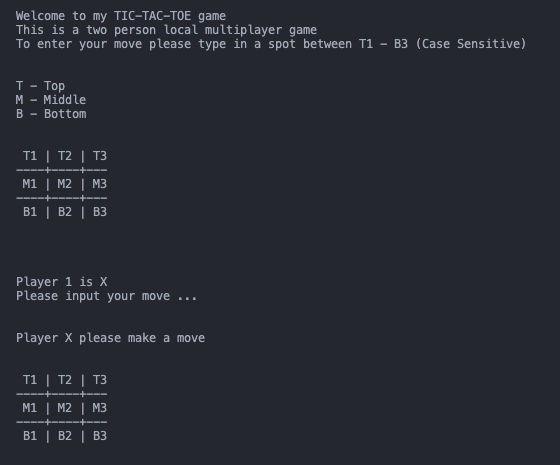

# Tic-Tac-Toe

Tic-tac-toe game designed In the command Line using Haskell
A 2 person Local multiplayer Game

### Running Instructions

- Install Haskell
- ghc must be installed and on the PATH. I used [ghcup](https://www.haskell.org/ghcup/) but Chocolatey works as well
- Open Terminal and relocate to the tic-tac-toe folder
- Now we run `ghci` which runs the compiler and gers us to Prelude. then we run `:l index.hs` which directs us to the Main in the code base
- At this point you are ready to start the game and can simply enter ` main`

### Screenshot of Tic Tac Toe Game

#### Game Rules

- Player X always starts first
- Every other rule is standard to the game

### Haskell for Beginners tips i learned

- to run ghci compiler you can do ghci and that compiles all changes then do :l {filename}. this gets you back to main.

- :r for reload

- :t gets the type declaration for what ever you typed in
- to run entire file compiler with main = do, run ghc -- make {filename}

- :q to quit compiler

### My most helpful resources

[Haskell Cheat sheet](https://www.newthinktank.com/2015/08/learn-haskell-one-video/)

[Youtube haskell tutorial for beginner](https://www.youtube.com/watch?v=02_H3LjqMr8)

[Learning about functors for use of map and fmap implementation](https://www.tutorialspoint.com/haskell/haskell_functor.htm)

[Understanding how deriving works along with how to use EQ & Show](https://www.seas.upenn.edu/~cis552/13fa/lectures/Classes.html)

[Haskell Operators and Lexical Notation](https://imada.sdu.dk/~rolf/Edu/DM22/F06/haskell-operatorer.pdf)

### Haskell Tic Tac Toe Resources

[Making tic tac toe in Haskell tutorial](https://www.youtube.com/watch?v=0-pOaa0dpko&t=149s) - I found this Resource very confusing when i first started developing my game but i wanted to get a rough idea of how i want to implement my code even before i start Pseudo-coding. i watched half the tutorial and decided it wasn't the path for i was trying to implement

[Hoogle Haskell](https://hoogle.haskell.org/) - Out of every resource i found, this has to be the most useful one. it gave a deep dive into methods in haskell by searching for the commands or the name.

### Learning and journey through completing this game

While building the game, i have to say the resources out there for Haskell is one of the oldest i have every seen but haskell is a pretty straight forward functional language that as long as you know the basics you can accomplish your task with time in hand.

Creating the game pieces the users will play with was the easiest part of the game but when it came to rendering the board on the Command Line. i got stumped for about a day or so. but with enough videos watched and reading documentation on how others did it. i was able to come up with an array method way that i implemented in my code.

If i had to do it over again, i don't think i would go with the array method simply because of how difficult it turned out to be to keep track of the Board spots index without creating another method to keep track of it. I do feel like this is the best method to keep track of all the running code in an organized manner.
